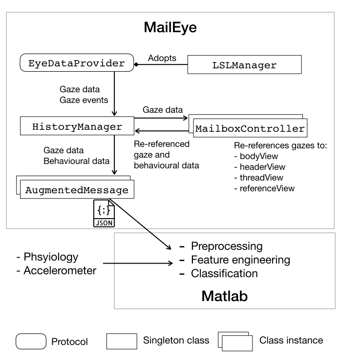
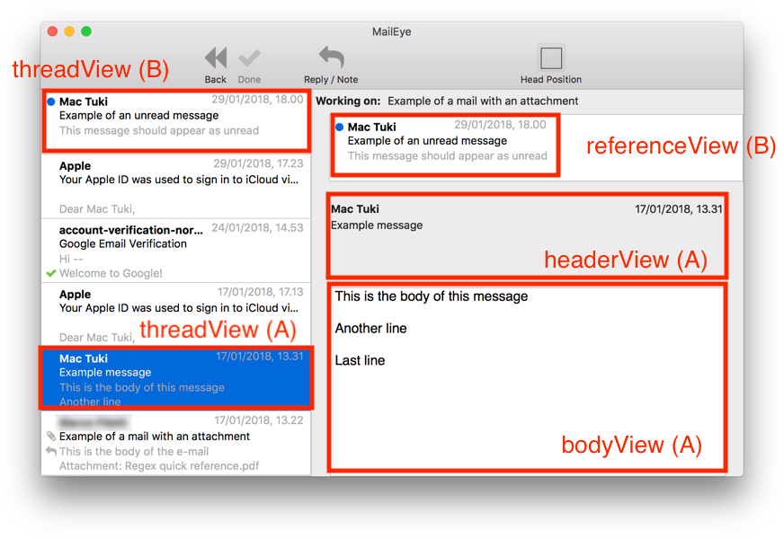

# MailPhys

This folder contains all that is needed to perform data collection in realistic e-mail work. Gaze, behavioural and mail data are re-referenced to invididual e-mails by the enclosed MailEye software.

The Matlab component that performs preprocessing and classification for the resulting data is provided in
[https://github.com/ForSubmission/MailPhys_analysis](https://github.com/ForSubmission/MailPhys_analysis)

# MailEye

MailEye is written in Swift 4 and requires macOS Sierra or higher. MailEye can open IMAP (including secure IMAP) connections to communicate with e-mail servers, or can read data stored on disk `mbox` format). IMAP server flags can be get and set (such as the `seen` flag, which indicates whether a message has been previously read). IMAP functionality is provided by [libcurl](https://curl.haxx.se).

The diagram below summarises the main classes that support MailEye's *awareness* and while maintaining *usability*, while also providing an overview of the whole system (including the [matlab analysis component](https://github.com/ForSubmission/MailPhys_analysis)).

This file reports on which implementation details are most central to the concepts of *awareness*, *usability* and *openness*. *Privacy* is protected by hashing all source data (such as sender identity, subject, e-mail body, keywords) using the MD5 algorithm. This algorithm was chosen for speed considerations, since all data is never stored on a third party server, and was handled solely by the researchers; applications which would store data in a more publicly accessible location may require a more secure algorithm (MailEye also supports SHA hashing via [String+Extensions](MailEye/MailEye/Extensions/String+Extensions.swift)).

## Central classes

The classes most central to our implementation are [HistoryManager](MailEye/MailEye/Model/HistoryManager.swift), [MailboxController](MailEye/MailEye/UI/MailboxController.swift), [AugmentedMessage](MailEye/MailEye/Data/AugmentedMessage.swift) and the protocol [EyeDataProvider](MailEye/MailEye/Eye%20Tracking/EyeDataProvider.swift). These aim to the maximisation of the *awareness* of the system while also preserving *usability*, as they are responsible for the synchronisation of gaze, behavioural data and interface events.

### EyeDataProvider

The [EyeDataProvider](MailEye/MailEye/Eye%20Tracking/EyeDataProvider.swift) protocol generalises eye tracking support. This protocol is concretely implemented by the [LSLManager](MailEye/MailEye/Eye%20Tracking/LSLManager.swift) class, used to read Lab Streaming Layer (LSL) streams. LSL streams are used to carry data streams retrieved from the SMI Red 500 eye tracker we utilised (the script to deliver SMI data over LSL is provided in the [SMI_LSL](SMI_LSL) folder in our repository). Additional eye tracking providers can implement this protocol in order to provide support for additional devices. For example, our [MockMouseTracker](MailEye/MailEye/Eye%20Tracking/MockMouseTracker.swift) implements this protocol to emulate eye tracking behaviour for testing purposes.

### MailboxController

The user's inbox is represented on screen by an instance of [MailboxController](MailEye/MailEye/UI/MailboxController.swift), shown below. The mailbox controller is aware of e-mail data displayed on screen and user interactions at all times, and is responsible to delivering events to the `HistoryManager`. The `HistoryManager.currentController` reference points to the current (frontmost) `MailboxController` if any. This reference (`HistoryManager.currentController`) is `nil` if the user is assumed to be doing something else rather than reading a message (e.g. another window is front, the window is currently being moved or scrolled or has been recently moved or scrolled).

### HistoryManager

[HistoryManager](MailEye/MailEye/Model/HistoryManager.swift) is a singleton class (that is, there is only one instance of the class at any given time). Its purpose is to centralise the collection of data across the application. The `HistoryManager.currentController` points to an instance of `MailboxController` if the user is believed to be reading an e-mail (if not, the `HistoryManager.currentController` reference is *nil*).

### AugmentedMessage

The [AugmentedMessage](MailEye/MailEye/Data/AugmentedMessage.swift) class implements [DiMeData](MailEye/MailEye/DiMe%20Data/DiMeData.swift), which itself adopts the Codable protocol and is hence encodable / decodable to JSON. DiMeData provides support for [DiMe](https://github.com/HIIT/dime-server) which can be used instead of JSON, if desired.

### Interaction between the main classes

The `MailboxController` is responsible for updating the `HistoryManager.currentController` reference. It points to itself every time the user generates an interface event associated to the start of reading a message (using the `HistoryManager.entry(_:)` method). Such events are, for example, scrolling, focusing *into* the controller, changing displayed message. If the user stops reading, for instance if current window is focused *out* to another window (e.g. a web browser), the reference to the current in `HistoryManager.currentController` is cleared by calling the `HistoryManager.exit()` method. This indicates that gaze data should no longer be collected (since it is the web browser window which currently “owns” the user's attention).

The `HistoryManager` also holds a reference to the message the user is currently working on (if any) in `HistoryManager.currentWork`. This reference points to an instance of [AugmentedMessage](MailEye/MailEye/Data/AugmentedMessage.swift), which represents a message (e-mail) *augmented* by the presence of behavioural and eye tracking data. The fields of the class implementation define all data which we store for an individual e-mail and we can subsequently export to file or content management system. The `HistoryManager.currentWork` represents the message the user is currently working on, and is used to simplify the assignment of tags and collection of data. It is assumed the user starts working on a message when the related message is viewed and no other message is currently being worked on (`currentWork` can be reassigned if it is not currently `nil`). The `currentWork` is nullified when the user presses the “Done” button to manually assign tags to an e-mail, signalling another message can now be worked on.

### Gaze data

To maximise *usability*, `EyeDataProvider`, `HistoryManager` and `MailboxController` communicate via lower-priority asynchronous calls, so that data can be collected without any visible jitter or locking of the interface. The procedure can be summarised as follows.

When an `EyeDataProvider` receives live gaze data (fixation duration and location), it passes this information to the `HistoryManager`, which in turn dispatches it to `HistoryManager.currentController`, if any. If this reference is found, the fixation location is passed via the `MailboxController.identifyTargetView` method, which determines if the fixation “belongs” to an e-mail message. Information relatable to e-mails is contained within boxes that are called *threadView*, *referenceView*, *headerView* and *bodyView* (all depicted in the screenshot above). If the box is a body view an additional step is performed: we collect *keywords*, which we define as all words present within 3° of visual angle of the current fixation (calculated using the distance of the user's head provided by the eye tracker and the current monitor's DPI).

These data, are added to a field in [AugmentedMessage](MailEye/MailEye/Data/AugmentedMessage.swift), called `gazes`, if they were collected when the user was working on the current message. If these were collected *before* the user started working on the current message (e.g. they were working on another message at the time), the are added to a field called `pre_gazes`. This helps in providing additional context to the gaze data retrieved. Similarly, a `post_gazes` fields contains that were collected *after* the user completed work on a given message. The `pre_gazes` data is firstly stored in `HistoryManager` and is added to an `AugmentedMessage` as soon as the user starts working on that message.

The `gazes`, `pre_gazes` and `post_gazes` fields contain a dictionary, were the key is a string representing the view in which the gaze was collected (e.g. `threadView` or `bodyView`) and the value is an `EyeDatum` (defined in [EyeData](MailEye/MailEye/Data/EyeData.swift)), which contains fixation duration, coordinates (view, not screen coordinates) and a unix timestamp.

The `threadView`, `bodyView` and `referenceView` are identifiers (in Cocoa terminology). The underlying views are, in fact, different classes. What all these classes have in common is that they implement the [MessageReferenceView](MailEye/MailEye/UI/MessageReferenceView.swift) protocol. This protocol provides a `correspondingMessageId` field, which uniquely identifies a message. This implementation allows us to generalise a view that points to a message, while also letting us implements all these views using the class which is most appropriate for its content. When gaze data falls within a view that implements `MessageReferenceView`, we look up the identifier and (e.g. `bodyView`) and store it in the correct `gaze` field (this is done in `MailboxController.identifyTargetView(_ view:, point:)`).

### Selections and visits

Similarly to gaze data, we collect [Selection](MailEye/MailEye/Data/Selection.swift)s and `visits` (of class [Event](MailEye/MailEye/Data/Event.swift)) for all messages, both during, before and after the user worked on a message. The data prefixed with `pre_` are initially stored in HistoryManager and will be committed to the related `AugmentedMessage` as soon as the user starts working on the given message. Similarly, data prefixed with `post_` contains data collected *after* the user worked on the given message. This provides addional context to the data and is especially useful for long-lasting sessions (i.e. it maximises the *awareness* of the system).
